  

    <h1>Hi there, I'm Daniel! 👋</h1>
    <h2>About Me</h2>
    
I'm a third-year Integrated Mathematics and Computer Science (IMCS) student currently attending Ontario Tech University. I absolutely love learning new things and solving tough problems. When I encounter a problem, I try it myself first and then research other ways to overcome it!

    
    <h2>Skills and Technologies</h2>
    
    <h3>Languages</h3>
    <ul>
      <li>Bash, C++, C#, CSS, HTML, Rust, Python, Java, JavaScript, Lua, Julia, SQL</li>
    </ul>
    <h3>Frameworks & Libraries</h3>
    <ul>
      <li>.NET, Sodium, Qt, Hibernate ORM</li>
    </ul>
    <h3>Build & DevOps Tools</h3>
    <ul>
      <li>CMake, Maven, Docker, Git, GitHub, NGINX, SSH, H2</li>
    </ul>
    <h3>Systems</h3>
    <ul>
      <li>Windows 7/8/10/11; GNU/Linux (Arch, Ubuntu, Debian)</li>
    </ul>
    <!-- <h3>Languages</h3>
    
    <h3>Tools</h3>
    
    <h3>Systems</h3>
     -->
    <h2>Goals</h2>
    <ul>
      <li>Learn shaders, especially GLSL.</li>
      <li>Learn Go, Odin, and Zig.</li>
      <li>Create 3D art in <a href="https://desmos.com">Desmos</a></li>
    </ul>
    <h2>Interests</h2>
    <ul>
      <li>AI</li>
      <li>Cryptography</li>
      <li>Cybersecurity</li>
      <li>Networking</li>
      <li>Open Source</li>
    </ul>
    <h2>Hobbies</h2>
    <ul>
      <li>Badminton</li>
      <li>Computer Tinkering</li>
      <li>Gaming</li>
      <li>Game Modding</li>
      <li>Photography</li>
    </ul>
    <h2>Fun Facts</h2>
    <ul>
      <li>I started programming in <a href="https://processing.org/">Processing</a> when I was 11, learning the fundamentals of programming while making some (bad) art!</li>
      <li>I first learned Java just to make Minecraft mods and plugins for my friends!</li>
      <li>I've always found physics really interesting, especially quantum and astro!</li>
      <li>My writing style has always used em dashes (—) and now all my old work screams AI :(</li>
      <li>I love cats!</li>
    </ul>
  

  

    
  

